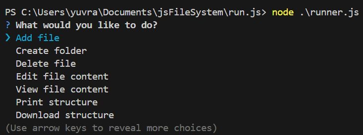

# JS File System CLI

A command-line interface tool for simulating a file system in JavaScript with features like file creation, editing, and directory management.



## 🚀 Features

- 📁 Create and manage directories
- 📄 Create, edit, and delete files
- 👀 View file contents
- 🌳 Print directory structure with visual formatting
- 💾 Export file structure to disk
- 🎨 Color-coded CLI interface

## 📦 Installation

```bash
npm install
```

## 🛠️ Usage

Start the CLI:

```bash
npm start
```

### Available Commands:

Command | Description
--------|------------
`Add file` | Create a new file in selected directory
`Create folder` | Create a new directory
`Delete file` | Remove an existing file
`Edit file content` | Modify file contents using editor
`View file content` | Display file contents
`Print structure` | Show directory tree structure
`Download structure` | Save structure to disk
`Exit` | Close the application